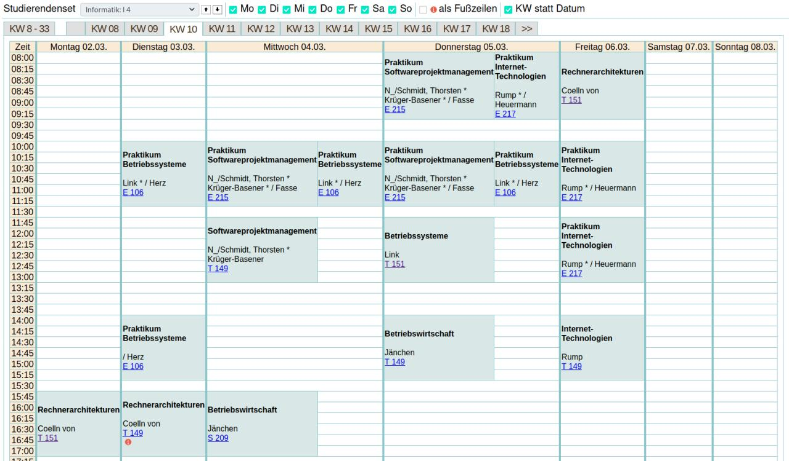
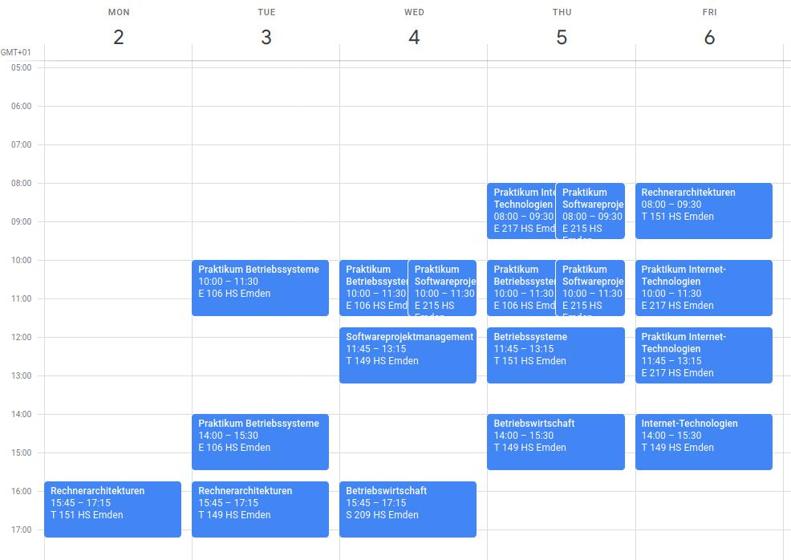

# SplanParser

This utility parses the HS Emden Student Plan an generates an iCal file.

It turns this

into this


# Usage (English)

1. Download the latest build [here](https://github.com/AnyTimeTraveler/SplanParser/releases/download/v1.0.0/splanparser-all-1.0.0.jar)
2. Run the jar: `java -jar splanparser.jar [url] [repetitions]`
3. You should see a file called `vorlesungen-[year].ics` appear in the same folder

The parameters are:
```
url: The URL of the __first__ week of the semester with your study selected
repetitions: Amount of weeks in the semester
```

# Verwendung (German)

1. Downloade den aktuellsten build [here](https://github.com/AnyTimeTraveler/SplanParser/releases/download/v1.0.0/splanparser-all-1.0.0.jar)
2. Fuere die jar aus: `java -jar splanparser.jar [url] [repetitions]`
3. Du solltest eine Datei namens `vorlesungen-[year].ics` im selben Ordner sehen

Die parameter sind:
```
url: Die URL der __ersten__ Woche des Semesters mit dem richtigen Studiengang ausgewählt
repetitions: Anzahl an Wochen im Semester
```
